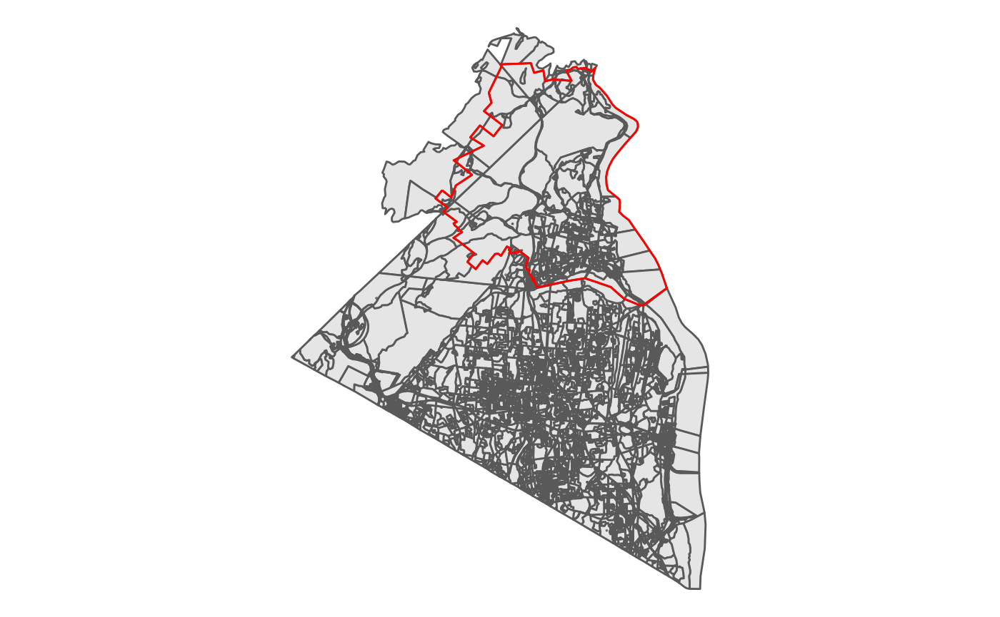
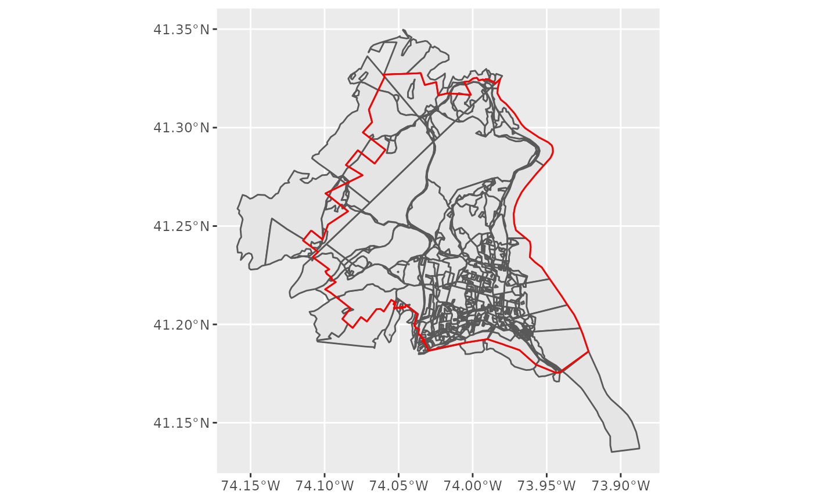
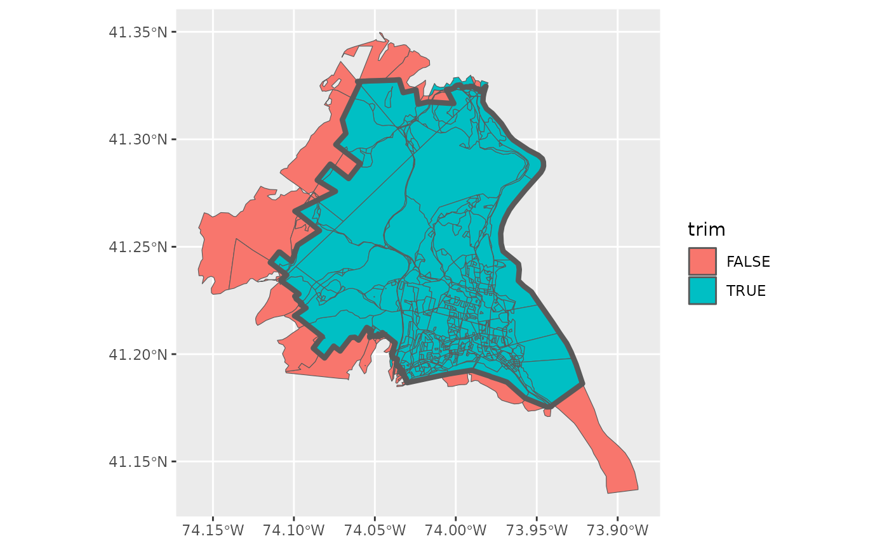
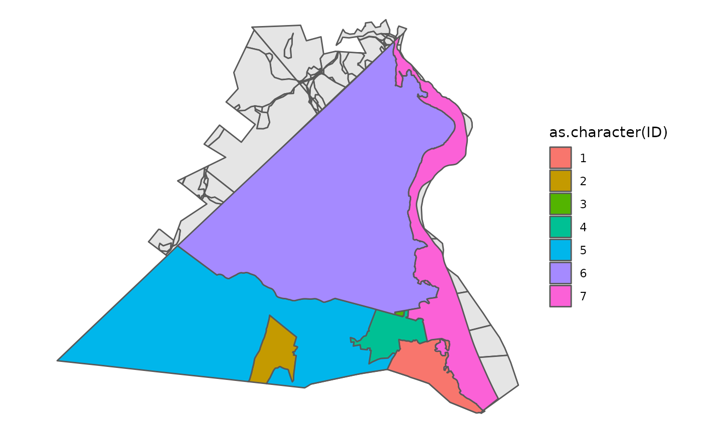
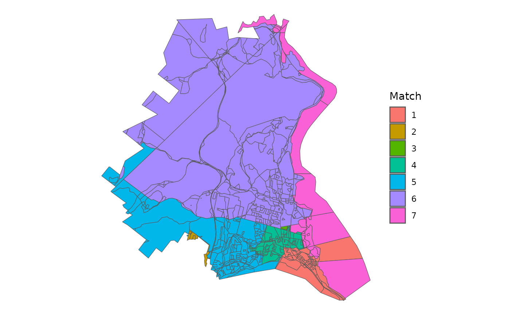

# Redistricting School Districts

The primary motivation behind this package is to make data preparation
steps easier for redistricting simulation methods within R. This
vignette covers a few key tasks, primarily building a block level
dataset of population data, subsetting by spatial relationship, and then
running a basic simulation. This is shown in the context of dividing
North Rockland Central School District in NY into 7 wards at the block
level.

``` r

library(geomander)

library(ggplot2)
library(dplyr)
library(stringr)

library(sf)
library(tinytiger)
```

First, we want to build a block level dataset. The school district
intersects two counties, though almost all of the population in the
district comes from Rockland County. create_block_table allows you to
build block level datasets with the primary variables needed for
redistricting purposes - total population by race and voting age
population (VAP) by race.

``` r

blockRockland <- create_block_table(state = 'NY', county = 'Rockland')
blockOrange <- create_block_table(state = 'NY', county = 'Orange')

block <- bind_rows(blockRockland, blockOrange)
```

For this vignette, rather than running the above, we use included data.
`orange` is a subset of Orange County which intersects with the school
district. Rockland is the entire block dataset. These polygons are
simplified using `rmapshaper` to make them smaller.

``` r

data("orange")
data("rockland")
block <- bind_rows(rockland, orange)
```

Next, we need the shape for North Rockland, which can be obtained from
the R package `tinytiger` as below. The same idea holds for having
target areas, such as counties or legislative districts, though they are
less likely to directly use the block level data.

``` r

school <- tt_unified_school_districts(state = 'NY') |> filter(str_detect(NAME, 'North Rockland'))
```

As above, we use a saved version that doesn’t need API access to
download.

``` r

data("nrcsd")
school <- nrcsd
```

The immediate and common difficulty here is that we have nearly 15,000
blocks, but the target region, in this case the school district outlined
in red is significantly smaller than that.

``` r

block |> ggplot() + 
  geom_sf() +
  geom_sf(data = school, fill = NA, color = 'red') +
  theme_void()
```


As a first pass, we can use the geo_filter function, which wraps sf’s
st_intersects and filters only to those that intersect.

``` r

block <- block |> geo_filter(to = school)
```

This drops us down to 852 block and is a conservative filtering, as you
only need to intersect at a single point.

``` r

block |> mutate(id = row_number()) |> 
  ggplot() + geom_sf() +
  geom_sf(data = school, fill = NA, color = 'red') 
```


Yet, we probably want to go further than that, getting rid of the
various external pieces. We can use geo_trim to do just that. First, we
want to check what would be thrown away at the default area threshold of
1%. Below, I’ve first checked what would be trimmed away, by setting
bool = TRUE and plotting it.

``` r

block$trim <- block |> geo_trim(to = school, bool = TRUE)

block |> ggplot() + geom_sf(aes(fill = trim)) + 
  geom_sf(data = school, fill = NA, lwd = 1.5)
```



To me, it looks like we are subsetting correctly with this threshold, so
we actually trim away this time.

``` r

block <- block |> filter(trim)
```

Very often, at this step, we want to consider including information
about other geographies, particularly towns, villages, or counties. In
the package, for illustration purposes, I’ve included a small towns
dataset from the [Rockland County GIS
Office](https://www.rocklandgis.com/portal/apps/sites/#/data/items/746ec7870a0b4f46b168e07369e79a27).

``` r

data("towns")

block |> ggplot() +
  geom_sf() +
  theme_void() +
  geom_sf(data = towns, aes(fill = as.character(ID)))
```



From this, we can then try to match our blocks to towns. I use the
centroid option, which often works the most quickly. The default method,
‘center’ is slower, but more accurate.

``` r

matched <- geo_match(from = block, to = towns, method = 'centroid')
```

Now, I’ve used the default tiebreaker setting, which assigns all blocks
to a town, even if they do not overlap.

``` r

block |> 
  ggplot() +
  geom_sf(aes(fill = as.character(matched))) +
  theme_void() +
  labs(fill = 'Match')
```


So, we want to make two particular edits to the outcome. First, we
create a fake Orange County Town for the blocks that come from Orange
County, though there are only a few dozen people who live in those
blocks.

``` r

block <- block |> mutate(TownID = matched) |> 
  mutate(TownID = ifelse(county != '087', 8, TownID)) 
```

Second, we can see that one block in 7 was matched to 1 because it
didn’t properly intersect the towns and thus went for the closest town
by distance between their centroids. A similar issue occured for two
other blocks.

Now, to figure out what’s going on and try to clean it up, we can build
an adjacency graph for each block by town and see which pieces are
discontinuous.

``` r

adj <- adjacency(shp = block)

comp <- check_contiguity(adj = adj, group = block$TownID)

which(comp$component > 1)
```

    ## [1] 576 586 591

Then, using that information, we can figure out three of these need to
be renamed.

``` r

block$TownID[409] <- 7
block$TownID[586] <- 2
block$TownID[591] <- 4
```

Now all towns are completely connected or contiguous.

``` r

comp <- check_contiguity(adj = adj, group = block$TownID)

which(comp$component > 1)
```

    ## integer(0)

Finally, we have the data in a simulation-ready state! We can now use
the adjacency list created above with redist.adjacency to run a
simulation using redist.smc. See [the redist
package](https://alarm-redist.org/) for more information about what’s
going on here.

``` r

library(redist)
```

    ## Loading required package: redistmetrics

    ## 
    ## Attaching package: 'redistmetrics'

    ## The following object is masked from 'package:dplyr':
    ## 
    ##     tally

    ## 
    ## Attaching package: 'redist'

    ## The following object is masked from 'package:stats':
    ## 
    ##     filter

``` r

map <- redist_map(block, pop_tol = 0.02, ndists = 7, adj = adj)

sims005 <- redist_smc(map, nsims = 50, counties = TownID, silent = TRUE)

plans <- get_plans_matrix(sims005) |> unique(MARGIN  = 2)

par <- redist.parity(plans = plans, total_pop = block$pop)

comp <- redist.compactness(shp = block, plans = plans, adj = adj, measure = 'EdgesRemoved')
```

    ## Warning in redist.compactness(shp = block, plans = plans, adj = adj, measure = "EdgesRemoved"): 'redist.compactness' is deprecated.
    ## Use 'comp_edges_rem' instead.
    ## See help("Deprecated")

``` r

comp_m <- comp |> group_by(draw) |> summarize(mean = mean(EdgesRemoved))

pick <- tibble(parity = par) |> bind_cols(comp_m) |> slice_max(order_by = mean, n = 1) |> pull(draw)
```

In short, the above uses a Sequential Monte Carlo algorithm to draw 50
compact districts that try to preserve towns. From those, I pick a map
that is on average, pretty compact. You would typically aim for about
100 times this number of simulations to start. This is shortened for
vignette compilation time.

Then we have the basic information we want and we can look at the VAP
data to see that we have one majority minority Hispanic ward and one
potential coalition ward.

``` r

block |> 
  mutate(district = plans[,pick]) |> 
  group_by(district) |> 
  summarize(across(starts_with('vap'), sum))
```

    ## Simple feature collection with 7 features and 10 fields
    ## Geometry type: POLYGON
    ## Dimension:     XY
    ## Bounding box:  xmin: -8250400 ymin: 5038222 xmax: -8228926 ymax: 5061114
    ## Projected CRS: WGS 84 / Pseudo-Mercator
    ## # A tibble: 7 × 11
    ##   district   vap vap_white vap_black vap_hisp vap_aian vap_asian vap_nhpi
    ##      <int> <dbl>     <dbl>     <dbl>    <dbl>    <dbl>     <dbl>    <dbl>
    ## 1        1  5169      4370       169      433        8       141        1
    ## 2        2  5057       923       475     3485       10       119        0
    ## 3        3  5473      4382       156      742        4       137        1
    ## 4        4  5335      4034       353      657        8       233        0
    ## 5        5  5149      1448       760     2667        8       197        1
    ## 6        6  5250      3095       710     1120        2       249        0
    ## 7        7  5027      2178       643     1928        6       194        2
    ## # ℹ 3 more variables: vap_other <dbl>, vap_two <dbl>, geometry <POLYGON [m]>
